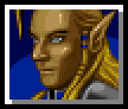
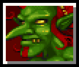
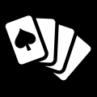
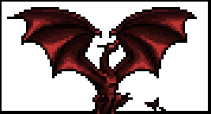

Dragon Dune
===========

A game for 4 players inspired by Avalon-Hill's Dune board game.

This was formally called Dragons, Usurpers, and Empires (DU&E), 
but the Internet hates ampersands.

So, let’s justify this things existence. Dune is a great game, but it
has it’s drawbacks. The rules are kind of ambiguous. It can take a while
to play. It can be tough to get 6 players together. Rex attempted to 
iron out some of these idiosyncrasies, but they got rid of things like 
binding agreements, which seem as fundamentally important to a political 
wheeling-and-dealing game like Dune.

This is an attempt to make a resource light game in the style of Dune,
that is friendlier to beginners, easier logistically (4 players instead
of 6), with greater rule clarity, and with a strong sense of theme
(taking place in a fantasy setting).

About This Game
---------------

The game is version 1.1.

This game is licensed Creative Commons Share-Alike 4.0.

Contact: <dragon.dune.game@gmail.com>

Github: <https://github.com/dragon-dune/dragon-dune>

Web: <http://dragondune.inkfox.org>

What You Need to Play:
----------------------

1.  The Board
2.  Faction Unit Markers (4 factions, 10 per faction)
3.  Gold Markers (approximately 60 total)
4.  Deck of Standard Playing Cards
5.  One Six-Sided Die
6.  One Troll Marker
7.  One Dragon Marker
8.  One First Player Marker

* * *

Board:
======

Special Rules:
--------------

1.  Territory 0• is the Great Mountain and is neutral territory. Players 
    will never battle in territory 0•.
2.  • territories represent forests. Units in a forest territory are 
    safe from dragon attack.
3.  ★ territories represent castles. Players or alliances need to 
    control 3 castles in order to win the game. Units in a castle are 
    safe from dragon attack.
2.  A player controls a castle if they alone have at least one unit there.
    Hidden units have no effect on castle control.
3.  Players in control of 3★ or 5★ have access to griffins and receive a
    travel bonus. They may move through four territories in the movement
    round (instead of 2).
4.  Players may never have more than 10 units between on the board and
    the player's graveyard at any one time.
5.  No more than two players may have units in a castle at one time.
    This does not count hidden units.
6.  Public agreements made in the game are binding and must be carried
    out, if possible. Public agreements can only be broken if all parties 
    involved terminate the agreement.
7.  Players may form alliances, but there can still be only one winning
    player. Forming an alliance grants your ally an alliance power.
    Alliances can only be formed or broken during a Great Council after
    a Red Dragon.
    (This is a change from Dune, which allows to players to share a victory.)
8.  Players placing units in the same territory as the Troll Marker (3★)
    lose 5 units in that territory at the end of their movement round.
    If there are still units in the territory after the units are removed,
    then the Troll Marker is also removed.

* * *

Factions:
=========

Dwarves (♦):
---------------------------

The Dwarves empire has fallen. The are forced to sell artifacts from
their treasuries with the hope of one day reclaiming their birthright.

Start With: 5 Gold, 1 Artifact.

Starting Units: None.

Special:

1.  The Dwarves collect all gold spent by other players on on
    artifact cards. Gold spent by the Dwarves on artifact cards goes to
    the bank.
2.  The Dwarves may use their Jack as a Usurper (Queen) and their Queen 
    as a Sabotaged Artifact (Jack). So, if they had the Queen of Spades 
    and the Jack of Hearts, they could also play as though they had the 
    Queen of Hearts and the Jack of Spades.
3.  Special Card (Ace): You may use an ace as a Sabotaged
    Artifact (Jack) of the same suit.
4.  Alliance Power: You pay half value (rounded up) for artifacts.

Elves (♥):
-----------------------

The ancient Elves have vast arcane knowledge, but they will need to be
clever to turn knowledge into gain.

Start With: 5 Gold, 1 Artifact.

Starting Units: 5 units in 5★.

Special:

1.  The Elves may see the artifact that is up for bid before
    bidding begins.
2.  In battle with the Elves (or their allies), the Elves may ask the
    color of their opponents artifact card, the value of the artifact
    card, or to know how many units they are sending in to battle before
    selecting their own card and units.
3.  At the beginning of the Recruitment and Movement Round, the Elves
    may see what the next event card will be.
4.  Elven units may go into hiding in a territory in order to
    escape conflict. Hidden units act in every way as though they did
    not exist. Hidden units may only come out of hiding if they move
    into a empty territory or they may declare that they are coming out
    of hiding at the end of the at the beginning of a turn.
5.  Special Card (Ace): You may discard a special card to place up to 
    2 units on any one territory for free.
6.  Alliance Power: Your ally may ask question before a battle just as
    the elves do.

Goblins (♣):
------------------------

The Goblins are ruthless mercenaries who fight for coin, even against
their own king. Their thirst for treasure finds them with a trove of
artifacts.

Start With: 3 Gold, 2 artifacts.

Starting Units: 3 units in 10★.

Special:

1.  Goblins collect all gold spent on hiring Goblin mercenaries. Gold
    spent by the Goblins on mercenaries goes to the bank.
2.  The Goblins (and their allies) pay half price (rounded up) for
    Goblin mercenaries.
3.  When the Goblins win an artifact cards, they get a second artifact
    card that is hidden from the Elves.
4.  The Goblins may have up to 8 artifact cards (instead of 4).
5.  The Goblins may disband units at the beginning of the movement round
    (instead of at the end).
6.  Special Card (Ace): You may discard a special card to stop a player 
    from hiring Goblin mercenaries that turn.
7.  Alliance Power: Your ally may may half price (rounded up) for Goblin 
    mercenaries (even the Orcs may do this) and you may disband units at 
    the beginning of the movement round.

Orcs (♠):
----------------------

The Orcs control the wild territories of the west. They worship the
mighty Red Dragon.

Start With: 3 Gold, 1 artifact.

Starting Units: 5 units split between 1★, 9• & 16•.

Special:

1.  Orcs may not hire mercenaries. Instead, they my raise armies in
    Orcish territories (16, 16• , 17, 18, 1, 1★, 2, & 2•) at no cost.
2.  The Orcs may move units 3 territories in the movement round
    (instead of 2).
3.  The Orcs take only half losses (rounded up) against Dragons.
4.  The Orcs take no losses from the Red Dragon, which they worship.
5.  The Orcs may conscript 2 units (instead of 1).
6.  The Orcs may ride the Red Dragon when it appears, if they are in the
    same location.
7.  The Orcs may remove 3 units from the graveyard on their Recruitment
    and Movement round (instead of 2 units).
8.  If no player has won at the end of the game, then Orcs are the
    default winner.
9.  Special Card (Ace): In the Dragon Round, you may move one stack of
    units to any location.
10. Alliance Power: Your ally may remove 3 units from the graveyard
    and may conscript 2 units a turn.

* * *

Cards:
======

-   Dwarven Graveyard (King of Diamonds)
-   Elven Graveyard (King of Hearts)
-   Goblins Graveyard (King of Clubs)
-   Orc Graveyard (King of Spades)
-   Orc Usurper (Queen of Spades)
-   Dwarven Usurper (Queen of Diamonds)
-   Elven Usurper (Queen of Hearts)
-   Goblin Usurper (Queen of Clubs)
-   Sabotaged Clubs Artifact (Jack of Clubs)
-   Sabotaged Diamond Artifact (Jack of Diamonds)
-   Sabotaged Heart Artifact (Jack of Hearts)
-   Sabotaged Spade Artifact (Jack of Spades)
-   Special Card (Aces, All Suits)
-   Artifacts (2 to 6, All Suits)

Special Card Actions:
---------------------

Aces are considered Special Cards.

Players may discard a Special Cards to:

1.  Not pay for an artifact card in the bidding round.
2.  Pay half of regular price for mercenaries in the Bidding and 
    Recruitment round.
3.  Move through one additional territory with your moved units in
    in the Bidding and Recruitment round.
4.  Ask what artifact is going to be played by your opponent in battle.
5.  May be played as an artifact in battle with a value of 1.

* * *

How To Play:
============

Rounds:
=======

Setup:
------

1.  The board is set up. Players place their starting units.
2.  One player is picked at random to be the Stating Player.
3.  The Dragon Marker is placed. Roll the die three times and add the 
    numbers. This is the starting location of the Dragon Marker.
4.  Place the Troll Marker on 3★. 
3.  Each player is given the King of their faction from the deck.
    They place this card face up in front of them. This is their
    graveyard. This is the only card that has to be shown. All other
    cards may be kept secret until used.
4.  Each player is dealt one of the Queens face down. Players may look
    at them.
5.  Each player is dealt one of the Jacks face down. Players may look
    at them.
6.  Each player is dealt one artifact card face down. Players may look
    at them.
7.  The Goblins are given a second artifact card face down, which they
    may look at.

I. Dragon Round:
----------------

1.  A six-sided dice is rolled, and the dragon marker is moved from
    its starting position that amount through the board, in
    numerical order. The dragon goes through all territories with
    the same numerical value, so the dragon would go to both 1★ and 1
    when the dragon was at 1. 

    - Note that the dragon marker never moves to territory 0•

2.  Any units or gold the dragon marker encounters as it moves 
    through the board that are not in a castle or forest are 
    removed form the game. 

    -   Note that Orcs only take half losses, rounded up.

3.  When the dragon marker reaches  territory 18, it will next move 
    to the 1★ and 1.
4.  In the Recruitment and Movement round, players may never recruit 
    units at or move units through or to a territory with the dragon 
    marker.

II. Event Round:
----------------

1.  An event card is flipped over.
2.  Gold is placed on that location, unless the dragon marker is at
    that location. If the dragon marker is at that location, then
    no gold is placed this turn.
3.  If the event card is the same color as the games current Starting 
    Player, then the Red Dragon has attacked the territory at the top
    of the event discard pile (the territory where the previous event 
    took place). All units and gold in that territory are lost.

    -   If the Orcs are in the same territory as the Red Dragon, they 
        may move some or all of their units at that location to any
        other location.
    -   In response to the appearance of the Red Dragon, a Great Council 
        is called immediately. This is the only time players may form or
        break alliances. The Great Council continues until all players 
        have passed or formed an alliance.
    -   The dragon marker does NOT go to the Red Dragons location. The
        dragon marker is only moved on the dragon round.

III. Bidding Round:
-------------------

The Starting Player is the first Starting Bidder.

One card is placed up for bid for each player that does not have their
maximum number of cards. For each card up for bid, one at a time.

1.  The Elves, and only the Elves, are shown the card.
2.  Players, starting with the Starting Bidder, bid on card.
3.  The winner receives the card and pays the Dwarves.

    - If the Dwarves win the artifact, their payment is payed to the bank.
    - The winner may play a Special Card to avoid paying.

4.  The whole process repeats for the next player in player order.
    For each card, the next player after the current Starting Bidder 
    (in player order) becomes the next Starting Bidder.

IV. Recruitment and Movement Rounds:
------------------------------------

The Elves must declare if any of their units are coming out of hiding.

Then, starting with the Starting Player, and the proceeding in player 
order, all players may (in the following order):

1.  If they current player is the Goblins (or their ally) they may 
    disband some or all of the units in one territory. Disbanded units 
    are removed from the board, but do not go to the graveyard.
2.  The current player may remove 2 units from the players graveyard.

    -  On the Orcs (and their ally's) turn, they may remove 3 units from 
       the graveyard.

3.  The current player may conscript 1 units from the bank onto
    any territory where they already have a unit. This action is free.

    -  On the Orcs (and their ally's) turn they may conscript 2 units.
    
4.  The current player may hire Goblin mercenaries at a cost of 1 gold
    per mercenary if it is in a city, or 2 gold per mercenary if it is
    into any other territory. The payment is made directly to the Goblins.

    -   Goblin mercenaries may not be hired in any territory where the
        dragon marker is present.
    -   Payments made by the Goblins (and their ally) are half price, 
    -   rounded up.
    -   The Goblin's payment is made to the bank.
    -   The Orcs may not hire mercenaries. Instead, they my raise armies 
        in Orcish territories (16, 16• , 17, 18, 1, 1★, 2, & 2s) at no cost.
    -   If the Orcs are allied with the Goblins then they may hire goblin
        mercenaries to any valid location at the usual rate, or may raise 
        armies in the Orcish territories, but they may not do both.
    -   The player may play a Special Card to pay half the standard price, 
        rounded up.

5.  The current player may move some or all units from one location
    through two territories.

    -   Units may not move through or to any location where the dragon 
        marker is present.
    -   The Orcs may move through three territories.
    -   If the player has access to griffins (if they control of 3★ 
        or 5★) then they may move through four territories.
    -   The player may play a Special Card to extend their movement 
        range by 1 territory.

6.  Players may disband some, or all, of the units in one territory.
    Disbanded units are removed from the board, but do not go to the 
    graveyard.
7.  If a player placed units in the same territory as the Troll Marker, 
    then 5 units in that territory are removed. If there are still units 
    then the Troll Marker is also removed.
7.  Then the whole process repeats for the next player in player order.

V. Battle Round:
----------------

Starting with the Starting Player, and the proceeding in player order, if 
a player has units in the same territory another player, they shall do 
the following (in the following order):

1.  The player whose turn it is is the attacking player.
2.  If the Elves (or their ally) are taking part in the battle, they may 
    ask what artifact their opponent will play, or ask the size of the army 
    they will send into battle. The answers to these questions are binding.
3.  Each player secretly records how many units they will send as an
    army into battle, and they may select one artifact to use in
    the battle. For each unit sent into battle the army receives two
    points of battle value.
4.  Players reveal the size of their armies and their artifacts selected.
5.  For each color (red and black), whomever played the lower numbered
    artifact of that color, gets that amount added to their battle value.
    If two artifacts of the same color are played, the higher valued 
    artifact is discarded, regardless of who wins the battle.
6.  The player with the highest battle value wins the battle. In the case
    of a tie, the attacker wins.
7.  The winner removes all units used in an army in the battle.
8.  The loser removes all tokens from the territory, regardless of whether
    or not they took part in the battle. The loser also discards all
    artifact cards used.
9.  If a player who took part in the battle has a their opponent as
    their usurper, and has a sabotaged artifact of the same suit as the
    artifact their opponent played, then they may declare their
    treachery and automatically win the battle, taking no losses. The
    loser removes all units from the territory (even those not used in
    the battle), and discards any artifacts used in the battle.
9.  This process continues until all battles for a player are resolved.
10. Then the whole process repeats for the next player in player order.

VI. Collection Round:
---------------------

1.  All players receive 1 gold.
2.  Players collect gold from any territories they control. They can
    collect two gold for every unit in the territory, up to the amount
    of gold in the territory.
4.  If players wish, they may discard some or all of their artifacts.

VII. Victory Round:
-------------------

1.  The next player in player order becomes the Emperor.
1.  The next player (in player order) after the current Starting Player
    becomes the Starting Player for the next turn.
2.  If any player controls three castles then they have won the game.
3.  If 8 turns have passed without a winner, then the Orcs win.
4.  If then game has not ended, then it goes back to the Dragon Round.

* * *

Advanced Faction Powers:
========================

What could be more Dune-like than having optional rules that no one can 
agree on. Here are additional faction powers that may add depth or help
balance the game.

-   Orcish Plunder: The Orcs may steal artifacts. When they win a battle, 
    they may take one of your opponents artifacts (randomly chosen), 
    which they may then keep or discard for a reward of 1 gold.
-   Dwarven Elite Warriors: The Dwarves are fierce warriors. They have two 
    special units, which act as normal units in every way except that 
    each unit counts as two units for the purpose of combat.
-   Elven Blessing: After the Elves have lost 3 units in combat, they are
    given the power to invoke a blessing for one battle once per turn that 
    gives them an bonus battle point and makes it so they can not be 
    sabotaged for that battle.
-   Goblin Initiative: The Goblins may take their turn in the Recruitment 
    and Movement round at any time, regardless of player order.

Balancing Options:
==================

An easy way to balance the game is to give a player more gold or to give
them a greater reserve of units (for example, having 12 units available 
instead of 10). You could dial forward or back faction abilities, unit 
regeneration, unit conscription, anything. Really, it's a game. Play it 
however makes you happy.

* * *

Special Thanks:
===============

I would like to thank the creators of Dune and Rex.

I would like to thank artists that make their work available to the open
source community.

-   Jinn’s Icons (by Jinn) 
    https://opengameart.org/content/jinns-icons
-   Wyvern and Girl (by 5hiroi)
    https://opengameart.org/content/wyvern-and-girl
-   Dragon head icon (by Lorc)
    http://game-icons.net/lorc/originals/dragon-head.html
-   Crossed swords icon (by Lorc)
    http://game-icons.net/lorc/originals/crossed-swords.html
-   Locked chest icon (by Lorc)
    http://game-icons.net/lorc/originals/locked-chest.html
-   Card pickup icon (by Quoting)
    http://game-icons.net/quoting/originals/card-pickup.html
-   Mounted knight icon (by Skoll)
    http://game-icons.net/skoll/originals/mounted-knight.html
-   Coins icon (by Delapouite)
    http://game-icons.net/delapouite/originals/coins.html
-   Poker Hand icon (by Lorc)
    http://game-icons.net/lorc/originals/poker-hand.html
-   Ace icon (by Lorc) 
    http://game-icons.net/lorc/originals/ace.html
-   Overworld Tiles (by Buch) 
    https://opengameart.org/content/overworld-tiles-0
-   Throne king icon (by Delapouite under CC BY 3.0)
    http://game-icons.net/delapouite/originals/throne-king.html
